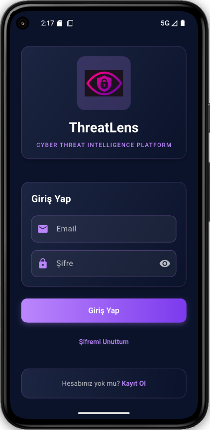
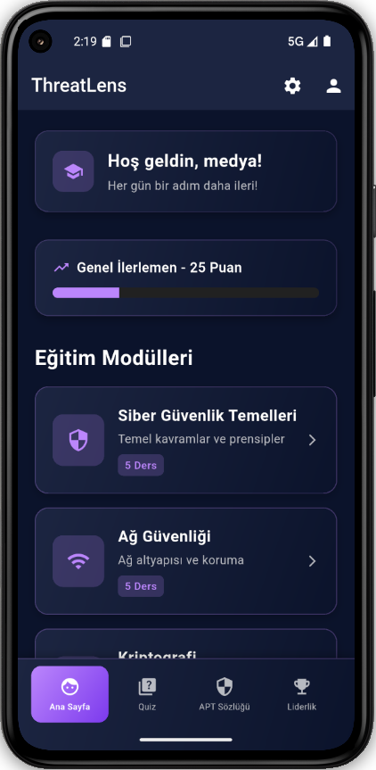
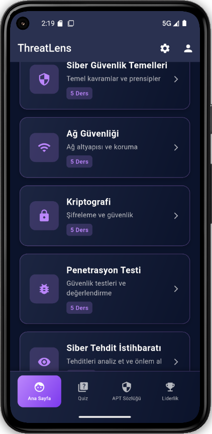
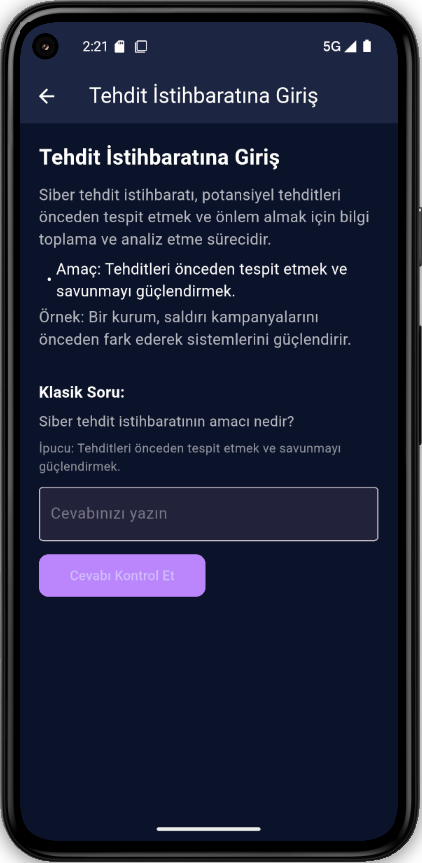
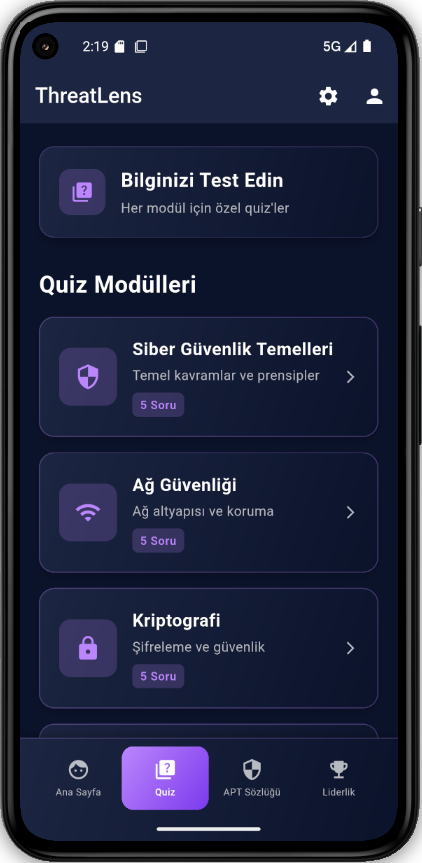
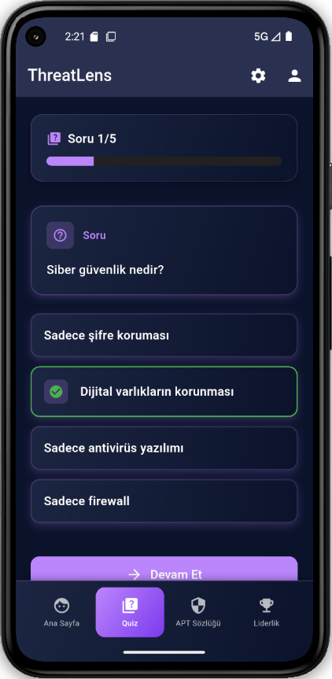
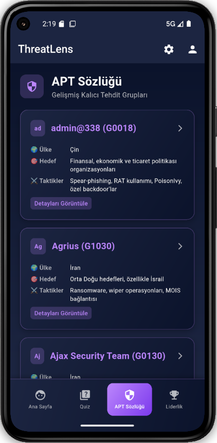
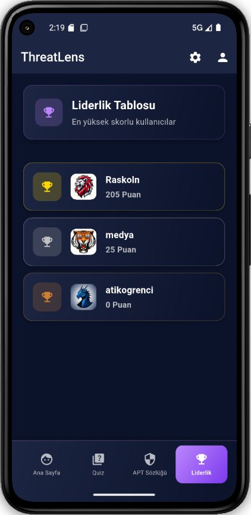
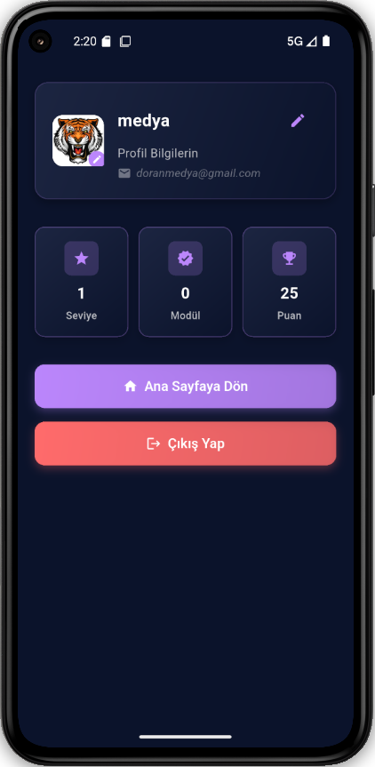
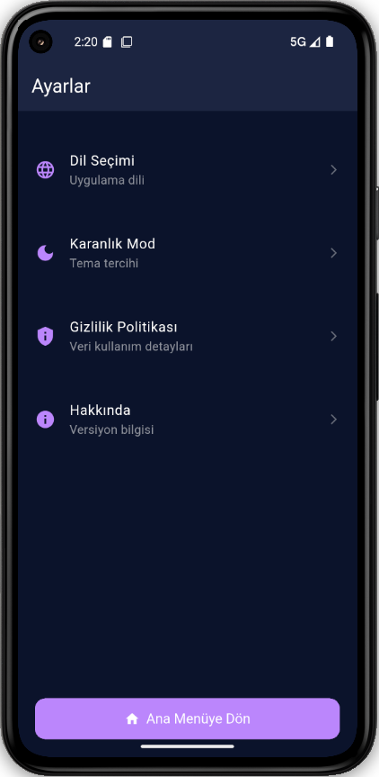

# 🛡️ ThreatLens

**ThreatLens**, siber güvenlik ve CTI (Cyber Threat Intelligence) eğitimlerini mobil ortamda interaktif, oyunlaştırılmış bir şekilde sunan bir öğrenme platformudur.  
Eğitim uygulamaları tarzında tasarlanmış bu uygulama; quizler, rozet sistemi, seviye puanlaması ve uygulamalı senaryolarla hem teknik personel hem de çağrı merkezi ekipleri için etkili bir öğrenme deneyimi sağlar.

---

## 🎯 Amaç

- Kullanıcılara **mobil cihazları üzerinden** istedikleri zaman CTI ve siber güvenlik konularında eğitim alma imkânı sunmak.
- **Çağrı yönetimi**, **müşteri etkileşim takibi**, **entegrasyon süreçleri** gibi temel kavramları interaktif içeriklerle öğretmek.
- Teknik ve yönetsel personele yönelik hem **temel** hem de **ileri düzey** bilgiler sunmak.

---

## 🧩 Özellikler

- 📱 **Mobil Uyumlu Eğitimler**  
  Eğitici modüller, kullanıcıların diledikleri anda mobil cihazları üzerinden erişebileceği şekilde tasarlanmıştır.

- 🧠 **Quiz ve Sınav Sistemleri**  
  Her modülün sonunda quizler ile bilgi ölçümü yapılır. Doğru cevaplar puan kazandırır.

- 🏅 **Rozet ve Seviye Sistemi**  
  Başarıya göre kullanıcılar rozet kazanır ve seviyeleri artar. Bu sistem motivasyonu artırır.

## 📚 İçerik Konuları

- Cyber Threat Intelligence (CTI) Temelleri  
- Çağrı Merkezi Entegrasyonları  
- Tehdit Analizi ve Raporlama  
- Sosyal mühendislik ve oltalama farkındalığı  
- Günlük siber tehdit örnekleri

---

## 🚪 Giriş Ekranı

## 🏠 Ana Sayfa

## 📚 Modüller

## 📦 Modül İçerikleri

## ❓ Quiz

## 📝 Sorular

## 🗂️ APT Dictionary

## 🕵️‍♂️ APT Analiz

## 🏆 Liderlik Tablosu

## 👤 Profil

## ⚙️ Ayarlar

---
